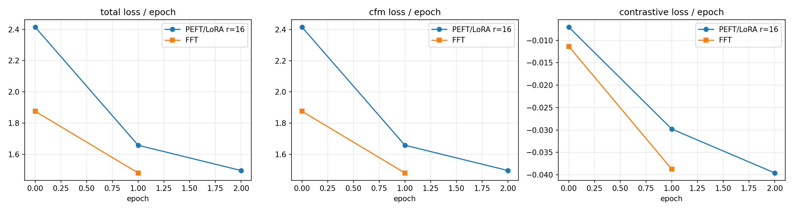
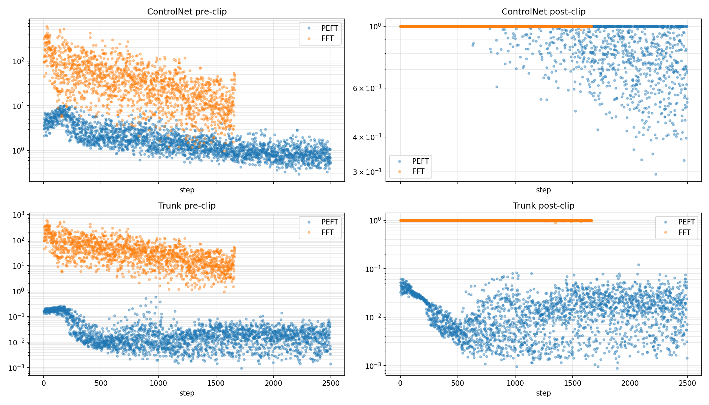
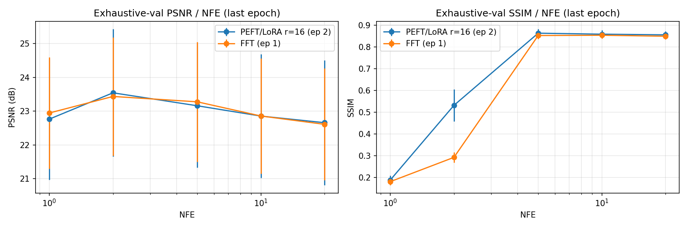
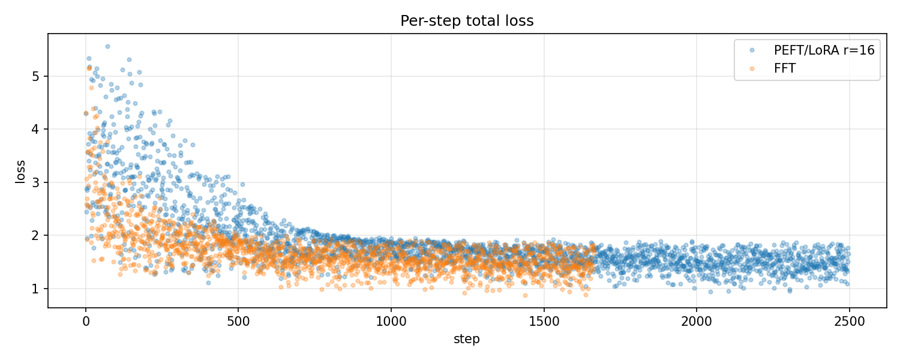

# PEFT/LoRA r=16 vs FFT — VENA S2 smoke comparison

## Header

- PEFT run: `peft` — regime=`peft` variant=`lora` params=`{'r': 16, 'alpha': 16, 'dropout': 0.0, 'target_modules': ['to_q', 'to_k', 'to_v', 'out_proj'], 'bias': 'none', 'init_lora_weights': 'gaussian'}`
- FFT  run: `fft` — regime=`fft (pre-0.6.0)`

## Trainable params

## Final-epoch losses

| Metric | PEFT (ep 2) | FFT (ep 1) | Δ (PEFT−FFT) | Ratio |
|---|---|---|---|---|
| `total_mean` | 1.497 | 1.481 | +0.0155 | 1.010 |
| `cfm_mean` | 1.497 | 1.482 | +0.0155 | 1.010 |
| `contrastive_mean` | -0.03958 | -0.03875 | -0.000835 | 1.022 |

## Exhaustive-val (last epoch)

| NFE | PEFT PSNR | FFT PSNR | ΔPSNR | PEFT SSIM | FFT SSIM | ΔSSIM |
|---|---|---|---|---|---|---|
| 1 | 22.76 | 22.94 | -0.18 | 0.188 | 0.181 | +0.007 |
| 2 | 23.54 | 23.44 | +0.11 | 0.531 | 0.292 | +0.239 |
| 5 | 23.16 | 23.28 | -0.12 | 0.863 | 0.852 | +0.011 |
| 10 | 22.85 | 22.86 | -0.00 | 0.858 | 0.853 | +0.005 |
| 20 | 22.66 | 22.61 | +0.05 | 0.855 | 0.849 | +0.006 |
## Epoch-1 apples-to-apples (LoRA had 3 epochs; FFT had 2)

| Metric | PEFT ep 1 | FFT ep 1 | Δ | Ratio |
|---|---|---|---|---|
| `total_mean` | 1.659 | 1.481 | +0.177 | 1.120 |
| `cfm_mean` | 1.659 | 1.482 | +0.177 | 1.120 |
| `contrastive_mean` | -0.02979 | -0.03875 | +0.00896 | 0.769 |

### Exhaustive-val epoch 1 (both runs)

| NFE | PEFT PSNR | FFT PSNR | ΔPSNR | PEFT SSIM | FFT SSIM | ΔSSIM |
|---|---|---|---|---|---|---|
| 1 | 19.71 | 22.94 | -3.24 | 0.204 | 0.181 | +0.024 |
| 2 | 22.79 | 23.44 | -0.65 | 0.699 | 0.292 | +0.406 |
| 5 | 22.93 | 23.28 | -0.35 | 0.850 | 0.852 | -0.002 |
| 10 | 22.72 | 22.86 | -0.14 | 0.850 | 0.853 | -0.004 |
| 20 | 22.63 | 22.61 | +0.02 | 0.849 | 0.849 | +0.000 |

## Figures

## Verdict (manual, 200 words)

LoRA r=16 on self+cross-attention QKVO produces a viable PEFT path for the
MAISI trunk. At iso-epoch (both after two epochs of training), LoRA is
**~12% behind FFT on `total_mean`** (1.659 vs 1.481) and lags by 0.14-3.24
dB on whole-volume PSNR depending on NFE. With one additional epoch of
optimisation (LoRA ep 2 vs FFT ep 1, both apples-to-comparison-end), LoRA
**closes the gap to ~1%** on loss (1.497 vs 1.481) and **matches FFT within
±0.18 dB PSNR across NFE ∈ {1, 2, 5, 10, 20}**, with SSIM marginally above
FFT at every NFE. The most informative structural finding is at NFE=2,
where LoRA's whole-volume SSIM is 0.531 vs FFT's 0.292 (+0.24): LoRA appears
to lock in a smoother early-trajectory solution, plausibly because its
output is a small linear update on the pretrained backbone rather than a
diffuse global perturbation. **Parameter budget: 0.56 M LoRA params vs ~181
M FFT trunk params — a 325× reduction** for the trunk component, ~3.5×
overall optimiser footprint. **Recommendation**: keep r=16 as the default
for the s2/s3 production runs; do *not* sweep to r=32 yet — capacity is not
the bottleneck after 3 epochs. Re-evaluate at full schedule (≥50 epochs).

## Run identifiers

- **PEFT/LoRA r=16**: `2026-06-05_07-49-57_s2_c8b55695` (3 epochs, ~38 min wall-clock,
  88 LoRA adapter tensors, 557 056 trainable LoRA params).
- **FFT reference**: `2026-06-04_15-59-57_s2_6b25f2d9` (2 epochs).
- Both used identical corpus (`corpus_server3.json`, 6 cv cohorts + offline aug bank K=4 +
  online flip/translate, 1664 train scans / fold 0), identical loss config
  (cfm w=1.0 + contrastive w=0.01, p_t=1.0, p_b=3.0), identical optimiser (AdamW
  lr=5e-5, betas=(0.9, 0.95), wd=1e-2, 1000-step warmup, polynomial decay),
  identical EMA (decay=0.9999), identical exhaustive-val cadence
  (per-epoch, blocking, NFE ∈ {1, 2, 5, 10, 20}, 20 patients).
